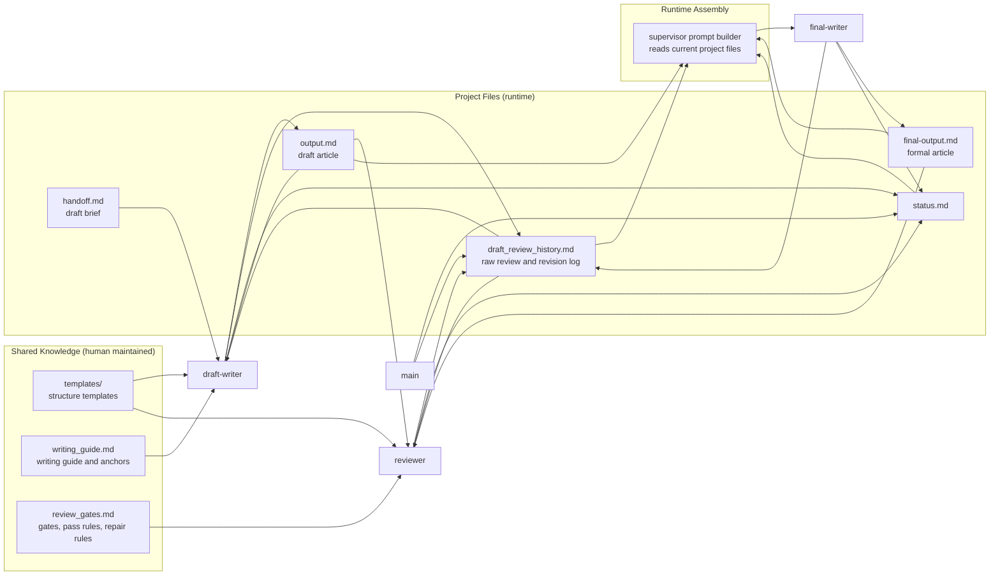
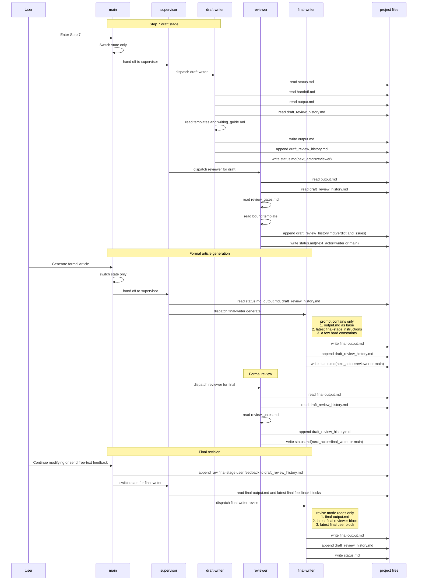
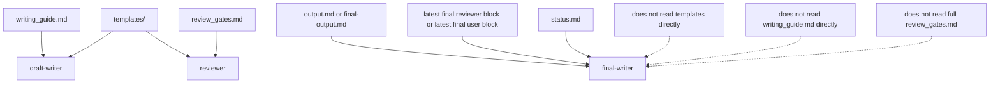
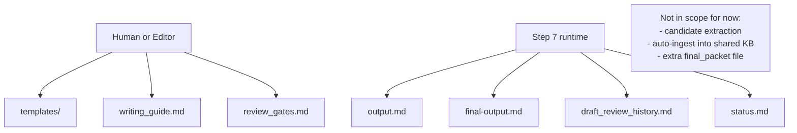

# Singularity Step 7 Knowledge Loading

This document records the agreed minimal Step 7 knowledge-loading design.

Principles:

- `draft-writer` reads thick shared writing context.
- `reviewer` reads shared gates and review rules.
- `final-writer` does not read thick shared knowledge directly.
- `main` does not build an extra `final_packet` file.
- `supervisor` assembles the minimal `final-writer` prompt from existing project files.
- Runtime writes only project files, not shared knowledge libraries.

## Minimal Architecture

## Full Loading Sequence

## Knowledge Loading Comparison

## Knowledge Maintenance

## Read and Write Boundaries

- `draft-writer`
  - Reads: `handoff.md`, `output.md`, `draft_review_history.md`, `templates`, `writing_guide.md`
  - Writes: `output.md`, `draft_review_history.md`, `status.md`
- `reviewer`
  - Reads: current article file, `draft_review_history.md`, bound template, `review_gates.md`
  - Writes: `draft_review_history.md`, `status.md`
- `final-writer`
  - Reads on first formal pass: `output.md`, `status.md`, latest final-stage instructions assembled by supervisor
  - Reads on final revision: `final-output.md`, `status.md`, latest final reviewer block, latest final user block
  - Writes: `final-output.md`, `draft_review_history.md`, `status.md`
- `main`
  - Writes only state and user raw feedback
  - Does not build a dedicated `final_packet` file
  - Does not write article body

## Minimal Final-Writer Inputs

The final-writer only needs:

1. the current base article file
2. the latest raw final-stage feedback
3. a small set of hard constraints embedded in the supervisor dispatch

The final-writer does not need:

- full writing knowledge libraries
- full gate libraries
- full debate history
- a dedicated extra handoff file for final generation
